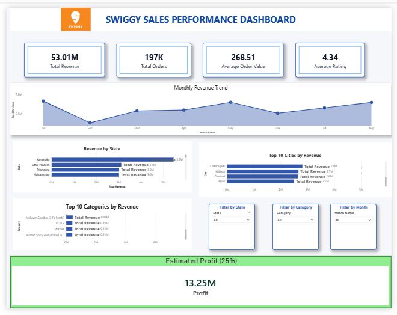

# 🍽️ Swiggy Sales Analysis

An end-to-end Data Analytics project that analyzes Swiggy sales data using **Python, PostgreSQL, SQL, and Power BI**. The project demonstrates data cleaning, exploratory data analysis, SQL-based business analysis, and interactive dashboard development.

---

# 📖 Project Overview

This project analyzes Swiggy sales data to identify business insights such as revenue trends, restaurant performance, customer ratings, food categories, and regional sales performance.

The workflow followed in this project:

- Data Collection
- Data Cleaning using Python
- Exploratory Data Analysis (EDA)
- PostgreSQL Database Integration
- SQL Business Analysis
- Power BI Dashboard Development

---

# 🛠️ Tech Stack

- Python
- Pandas
- NumPy
- Matplotlib
- Seaborn
- Plotly
- PostgreSQL
- SQL
- Power BI
- Microsoft Excel

---

# 🐍 Python Analysis

Python was used for:

- Data Loading
- Data Cleaning
- Exploratory Data Analysis (EDA)
- KPI Calculations
- Feature Engineering
- Monthly Sales Trend
- Daily Revenue Analysis
- Veg vs Non-Veg Classification
- Data Visualization
- PostgreSQL Data Upload

Libraries Used:

- Pandas
- NumPy
- Matplotlib
- Seaborn
- Plotly
- SQLAlchemy

---

# 🗄️ SQL Analysis

The project contains **30 PostgreSQL SQL Queries** covering:

- Total Revenue
- Total Orders
- Average Order Value
- Revenue by State
- Revenue by City
- Revenue by Food Category
- Monthly Revenue
- Quarterly Revenue
- Restaurant Performance
- Rating Analysis
- Window Functions
- Common Table Expressions (CTEs)
- Revenue Ranking
- Business Summary

---

# 📊 Power BI Dashboard

The interactive dashboard includes:

- Total Revenue
- Total Orders
- Average Order Value
- Highest & Lowest Order Value
- Revenue by State
- Revenue by City
- Revenue by Food Category
- Monthly Revenue Trend
- Average Rating Analysis
- Top Restaurants
- Interactive Filters & Slicers

---

# 📈 Key Insights

- Identified the highest revenue-generating states and cities.
- Compared restaurant performance based on revenue.
- Analyzed monthly sales trends.
- Compared Veg vs Non-Veg revenue contribution.
- Identified premium-priced dishes.
- Evaluated restaurant ratings across different states.

---

# 📷 Dashboard Preview

> Add your Power BI dashboard screenshot here.

---

# 📁 Dataset

The dataset contains:

- Restaurant Name
- Dish Name
- Category
- Food Category
- Price (INR)
- Rating
- Rating Count
- City
- State
- Location
- Order Date

---

# 🎯 Skills Demonstrated

- Data Cleaning
- Exploratory Data Analysis
- Data Visualization
- SQL Query Writing
- PostgreSQL Database Management
- Power BI Dashboard Development
- Business Intelligence
- Data Storytelling

---

# 👨‍💻 About the Author

Hi, I'm **Yash Shinde**, an aspiring **Data Analyst** passionate about transforming raw data into meaningful business insights using **Python, SQL, PostgreSQL, and Power BI**.

---

# 📬 Connect with Me

- **GitHub:** https://github.com/Yash-2026
- **LinkedIn:** https://www.linkedin.com/in/yash-shinde-bb1426344/

⭐ If you found this project useful, don't forget to star the repository.
